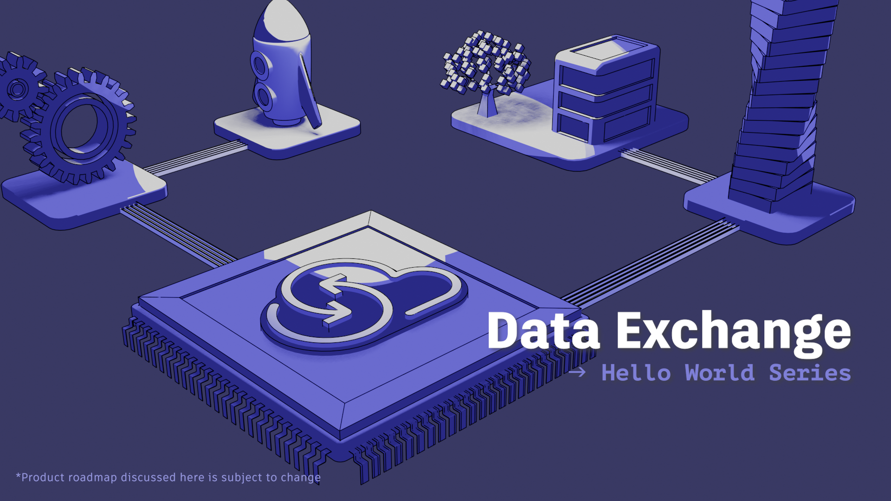

# Video Demo
[](https://youtu.be/qKphF3JZs0M?si=dhO1mK5MXZUnOAGS)  
[Video demo](https://youtu.be/qKphF3JZs0M?si=dhO1mK5MXZUnOAGS) | [Blog post](https://aps.autodesk.com/blog/data-exchange-dx-sdk-public-beta-update-now-available)

# GraphQL Queries
```graphql
query getAll($exchangeId: ID!) {
  exchange(exchangeId: $exchangeId) {
    id
    name
    elements {
      results {
        id
        name
        properties{
          results {
            name
            value
          }
        }
      }
    }
  }
}
`Variables:
{
  "exchangeId": "{yourExchangeId}"
}`

query getPropertiesForElementsOfCategory($exchangeId: ID!) {
  exchange(exchangeId: $exchangeId) {
    id
    name
    version {
      versionNumber
    }
    elements(filter: {query: "property.name.category=='Structural Beam System'"}) {
      results {
        id
        name
        properties(filter: {names: ["Phase Created", "FireRating080a9d9a-6080-408c-8398-9c86486d06eb"]}) {
          results {
            name
            value
            propertyDefinition {
              description
              specification
              id
              units
            }
          }
        }
      }
    }
  }
}  
`Variables:
{
  "exchangeId": "{yourExchangeId}"
}`